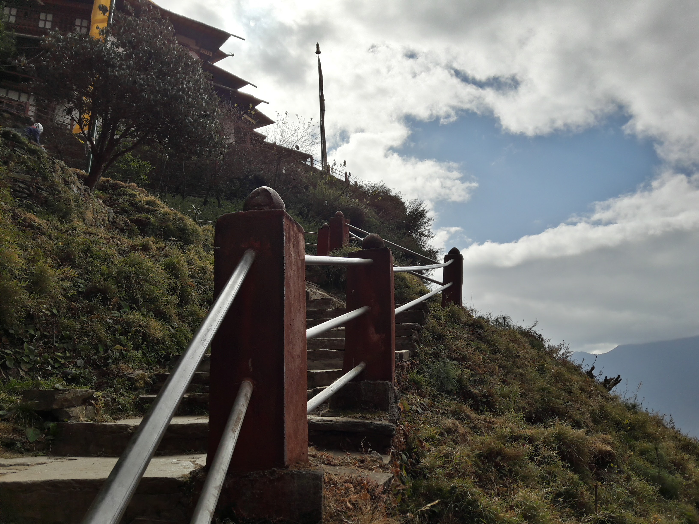

Hybrid Images and Image Enhancement
===============

## Hybrid Images

As described in the [paper](http://cvcl.mit.edu/publications/OlivaTorralb_Hybrid_Siggraph06.pdf) by Olivia, Torralba, and Schyns, hybird images are static images the interpretation of which changes as a funtion of the viewing distance.

In particular, the high spatial frequencies an image are more visible to the human eye upclose while the low spatial frequencies take precedence when further away from the image.

I have leveraged this intuition to produce the hybrid images.

The original images (shown below) were selected on the basis of their high frequency and low frequency components.

## Starbucks Logo (Low frequency)

*Image 1: The Starbucks logo is easily recognizable even when blurred, which made it a good option for a low frequency iamge.*

## Light through a barren tree (High Frequency)

*Image 2: The light from a lampost photographed through a barren tree provides an image with high frequencies. Notice how it creates a circular pattern.*

Two versions of the result are shown below. The process used to produce the result is described further below.

## Final Result
### Without Color

*Image 3: The image of the trees is apparent from close and the Starbucks logo becomes evident from a distance*

### With Color

*Image 4: The Starbucks logo is more easily recognizable with color*

## Procedure
#### High Level Description
* #### Produce a low pass filtered version of Image 1
* #### Produce a high pass filtered version of Image 2
* #### Add the two images in the frequency domain to obtain the hybrid image.

For the first step I computed a gaussian kernel (matlab script `compute_kernel.m`). This gave me flexibility to change the resolution of kernel and the `sigma` value. To produce the low pass filtered image, I used the convolution function provided my Matlab (`conv2`) to produce the gaussian blurred image (low pass filtered) shown below

#### Low Pass Filtered Image 1

*Image 5: Low pass filtered Starbucks Logo. Note that only the Blue Channel is shown here*

#### Corresponding Frequency Representation

For the second step in order to produce the high pass filtered version of Image 2, I first created the low pass version of Image 2 using the same process as used on Image 1. Then, I subtracted the low pass version from the original version leaving only the high frequencies.

#### High Pass Filtered Image 2

*Image 6: High Pass filter of Image 2. The effect of the high pass filter shows how the edges become more prominent*

#### Corresponding Frequency Representation

*This image is shown using a heatmap since it looks very similar to the final result*

#### Frequency Representation of Final Result
Combining the two images in the frequency domain I get the result as shown in Image 4.
Below is the frequency representation of Image 4 (the result).

### Observations
* The addition of the two images can be performed in spatial domain to get the same result although the paper describes it as an addition in the frequency domain.
* The effect of hybrid images is easier to see in Greyscale images.

## Additional Experiments
## Watermelon (Low frequency)

*Image 7: Taken from the [Walmart website](https://www.walmart.ca/en/ip/watermelon-mini-seedless-sold-in-singles/6000191284632)*

## Pizza (High Frequency)

*Image 8: The details show lots of high frequency components*

## PizzaMelon (Hybrid)

*Image 9: Shown in Greyscale as the colors of the pizza ruins the effect*

## Anakin Skywalker (Low Frequency)

*Taken from the internet*

## Darth Vader (High Frequency)

*Taken from the internet*

## AnaVader (Hybrid)

*Taken from the internet*

Image Enhancement
===================

## Contrast Enhancement
Contrast enhancement can be done in two ways:
1. Through filters like laplace and laplace of Gaussian.
2. Through histogram equalization.
I chose the histogram equalization approach since the filters usually introduce noise into the image. Furthermore, there are different methods of historgram equalization. I used the method shown [here](https://www.math.uci.edu/icamp/courses/math77c/demos/hist_eq.pdf)

### Mountainside Walkway in Bhutan

*Image 10: Taken in Bhutan*

### Result

*Image 11: Increased contrast and has the side effect of looking slightly more artisitc*  

### Notebook doodle

*Image 12: Doodle from my notebook*
### Second Result

*The effect is overdone and we can even see text from the otherside of the page*

#### Procedure
I split the images into each channel and then I performed histogram equalization on each of the channels. The resulting images showed an increase in contrast but the effect was too pronounced in some images (second result)

### Third Result

*Image 13: Histogram equalization through the V channel in HSV color space*

### Fourth Result

*Image 13: The effect is less pronounced*

#### Procedure (3rd and 4th result)
Rather than working on each channel in `RGB`, I updated my code to move the images into `HSV` color space and equalize the histogram of the `V` or `Value` channel. This produces better results.

## Color Enhancement

### Book

### Result

### Unhappy Jimi Hendrix

*Image 14: Taken at Madame Tussaud's, I chose this image because of the vivid colors already present in it and desaturated the image slightly*

### Result

*Image 15: The color values were perfectly restored*

#### Procedure
I initally tried to use the `Saturation` channel in HSV color space but that resulted in the image gaining and overall tint. I switched to the `CIE L*a*b*` color space and increased the `a` and `b` channels.
However, this is not an automatic process and requires me to set a value to increase it by.

## Color-Shift

### "Artistic" picture of my Motorbike

### More Red

### Less Yellow

*Image 16: This results in an overall blue color*

### Lights in a bottle

### More Red

### Less Yellow

*Image 17: The result is reminiscent of a Cross Process Filter*

### Mountain

### More Red

### Less Yellow

*Image 18: Increasing the blue gives the landscape a more colder look while the red makes it look like a surreal movie*

#### Procedure
I used Matlab's `rgb2lab` function from the Image Processing Toolkit, to convert the image into `CIE L*a*b*` color space. After that it was fairly easy to increase the `a` channel to make the whole image more red while decreasing the `b` made it less yellow (more blue). Again this is not an automatic process and requires me to set the value to increase or decrease the channel by.

-----------------------

## Bibliography
1. [Adobe's technical guide to the `CIE L*a*b*` color spcae](http://dba.med.sc.edu/price/irf/Adobe_tg/models/cielab.html)
2. [Stack Overflow Post which explains filters and their effect in the spatial domain; the question was posted by me](https://stackoverflow.com/questions/48260691/creating-a-high-pass-filter-in-matlab)
3. [Histogram Equalization](https://www.math.uci.edu/icamp/courses/math77c/demos/hist_eq.pdf)
